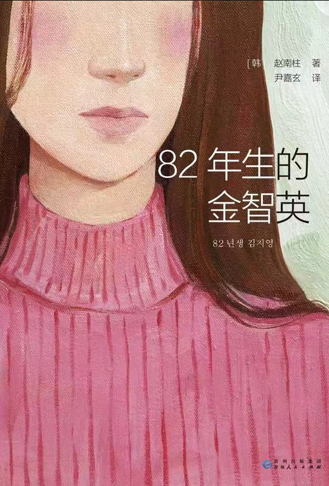

# 82年生的金智英

作者: 赵南柱[韩]

出版时间: October 3, 2016

出版社: 贵州人民出版社

字数: 10.5

状态: Finished

类型: 传记文学

读完的日期: August 2, 2021

## 2021.08.02

两个小时读完了这本10万字的小说，强迫自己做一下输出。

这是一本宣扬男女平等，批判韩国重男轻女现象的小说，这种现象不止在韩国有，可以说在相对来说思想比较落后的地区，这种现象是非常普遍的。甚至就算是现在，“女性只是家族的附庸”，这种观念仍然或有或无地存在我们的思想之中

> 许多男人会用“我都有帮你做家务、我都有帮你顾小孩”来捍卫自己的立场，殊不知光从“帮你”两个字就可以看出，他们普遍还是认为家务、育儿乃女人之事
> 

读到这一句话的时候我才意识到，平时已经司空见惯的话语中隐藏着的，是封建社会中，腐朽观念对人们的影响之根深蒂固。

> 这个社会看似改变了很多，可是仔细窥探内部细则和约定俗成，便会发现其实还是固守着旧习，所以就结果而论，应该说这个社会根本没有改变
> 

---

本书讲述了女主人公金智英从出生到少年时期、职场时期、怀孕以及生孩子之后的种种故事。

金智英，这个名字大概是那一个时代女性使用最多的名字，代表女主角是一个普通的不能再普通的人，或许就在你我的身边，她和身边的许多男生一样拥有自己的梦想，独立的意识，小时候因为自己是姐姐，所以处处被要求让着弟弟，在自己懵懂的时候试图用自我安慰做出合理化解释，却在长大成人之后不得不面对现实，无名的火焰在心中积攒，却因为当时腐朽的思想观念的原因，处处得不到他人的理解——小时候被男同学欺负、少年时期不被支持读书、步入职场受到歧视、因为不生孩子被怀疑健康、怀孕期间上班被阴阳怪气、独自带孩子的时候喝杯咖啡被别人说成“吃软饭的”。

> 其实当时还年幼的金智英，并不会羡慕弟弟的特殊待遇，因为打从他们一出生，受到的就是差别对待。虽然偶尔会觉得有点委屈，但她早已习惯这一切，并主动做出合理化的解释：因为自己是姐姐，所以要让着弟弟，并和自己性别相同的姐姐共享所有物品
> 

> “我被一个男的跟踪了” “你也不想想，他为什么跟踪你？”
> 

> “学校有规定，男生因为好动所以可以随意穿着，女生必须穿膝盖以下裙子，且裙子里面必须有衣物，上衣不可穿T恤，只能穿皮鞋”女学生：“我们女生也会跳皮筋跳格子也会运动为什么不能穿凉快一点”那个女学生因为违反校规被处分。
> 

> 她就是在这样的教育下长大的——女孩子凡事要小心，穿着要保守，行为要检点，危险的时间、危险的人要自己懂得避开，否则问题出在不懂得避开的人身上
> 

在她的生活中也有不少为女性争取权利的人——抓住暴露狂的女同学、硬刚老师的不合理制度的女学生、提出校服穿着问题的女同学，她们都在用自己的行动向不公之人索取自己应有的权利。这大概是本部书中唯一的亮色。

生活中面对的种种不公让她心中的火焰越来越大，正当我以为“她”要像斯特里克兰德一样要追随自己心中的理想的时候，她患上了抑郁症。

没有大众的喜闻乐见，没有触底反弹和一飞冲天，有的只是冰冷的事实，在那样一个年代，女性的声音是微乎其微的。

> 金智英感觉自己仿佛站在迷宫的中央，一直以来明明都脚踏实地地找寻出口，今天却有人突然告诉她，其实打从一开始这个迷宫就没有设置出口。其实人生中的各种苦难，谁都会面临，无关性别，只是许多人不愿承认这点
> 

我们总是认为对于凡事总是谨慎做决定、忠于自己的选择、全力以赴的金智英来说，这个社会应该给予她合理的补偿与鼓励，也应该给予她更多机会和选择余地才是

抑郁症的表现形式很奇怪，她会突然以自己身边的人的身份和语气说话。

> “最近智英可能会有些心力交瘁，因为她正处在身体渐渐恢复、心里却很焦虑的阶段。记得要经常对她说‘你很棒’、‘辛苦了’、‘谢谢你’这些话” （金智英本人对丈夫说）
> 

> “亲家公，恕我冒昧，有句话我还是不吐不快，只有你们家人团聚很重要吗？我们也是除了过节以外没有别的机会可以聚在一起好好看看这三个孩子，最近年轻人不都这样吗？既然你们的女儿可以回娘家，那也应该让我们的女儿回来才对吧。”（金智英以自己父母的身份对公公说）
> 

可能生活中受到了太多委屈，受到委屈的时候为了顾全大局，表面不敢表现出来，只能在自己的内心自顾自宣泄自己的委屈，但是现在自己不由自主地以别人的身份说出这些话。

她是在宣泄，是在说出自己的心声，她终于忍不住了，终于向其他人说出了自己的委屈——也开始了心理治疗。

到这里书中关于金智英的描写就结束了。

这本书是以金智英的心理医生的视角写的，医生听她叙说完，回到家，看到自己的妻子在做小学数学题。

> “你为什么在做小学数学题？里面的题对你来说应该没有难度”医生回到家，发现垃圾桶里都是妻子做完的草稿纸，一笔一划，工工整整。“享受解题的过程，因为这是我现在唯一能够获得快乐的方式。”医生突然想起了，妻子从小对数学感兴趣，一直是各种数学竞赛的第一名，理想是当数学教授，大学毕业之后也是草草结了婚，当起了“家庭主妇”妻子何尝不是另一个金智英？
> 

这本书留下了一个问题——金智英最后有没有被治愈？

被治愈了，也就意味着她继续把受到的委屈埋在心底，默默承受着这个世界对她的恶意和压迫；

不被治愈，在那个女性不被看重点年代里，作为有精神疾病的人，她会被人带着偏见看着，继续对抗着这个世界。

我认为，这个世界，需要更多不被治愈的金智英，或者说，希望世界上没有金智英。