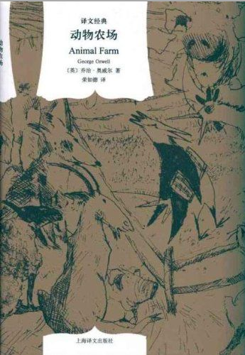

# 动物农场

作者: 乔治·奥威尔[英]

出版社: 上海译文出版社

字数: 6.0

状态: Finished

类型: 社会现实

读完的日期: Nov 22, 2021

荒诞不经的情节背后，影射的是更加魔幻的现实。

从动物的视角出发，将所谓的“高层社会”中“既得利益者”的演化和形象展现地淋漓尽致，似乎能在这个农场的动物群像中找出社会中所有人的影子。

我相信每一次起义或者革命，每一次变革的初衷都是好的，都是要改变社会现状，激浊扬清，可是当人真正坐上那个位置的时候，当人得到一系列的好处的时候，能不能守住本心，对这个人来说是一个巨大的挑战。

屠龙者终将变为恶龙。

在带领一众动物赶走了暴政的统治者之后，起义的头目坐上了领主的位置，在尝到了权力的滋味之后，便一发不可收拾，随之而来的是更加严苛的暴政、更加离谱的制度、更加荒谬的说辞，在野心的膨胀下，将一同制定的约定一条条打破，逐渐将自己的地位提升到“人上人”的程度，以子虚乌有的理由压迫底层人民，一意孤行地固执己见并强行要求“底层人民”无条件执行，并随着事件的流逝，把自己铸造的恶果埋藏在时间中，让自己的罪刑随着上一代人民的死亡而远去，自己则习以为常享乐，到最后隔着窗户“竟分不出来是人还是动物” 

> 动物们带着几分惊异的心情猛然想起，这是他们自己的农场，每一寸土地都是他们自己拥有的财产。此刻展现在他们眼前的正是大家心向往之的地方。然而这个农场在动物们心目中从来不像这样一片乐土。紫苜蓿顺着山坡朝下望去，她的眼睛噙着泪水。如果她能用语言表达自己的想法，应该说，几年前动物们决心为推翻人类而努力苦干，而现实与当初他们致力的目标完全是两码事。老少校第一次激励他们起来造反的那天夜里，他们开始期盼的也绝非这些恐怖和屠戮的惨状。如果说紫苜蓿在心中为自己设计过什么关于未来的蓝图的话，那幅蓝图上将是一个摆脱了饥饿和鞭子的动物社会，大家一律平等，工作各尽所能，强者卫护弱者，就像在听少校演讲之夜紫苜蓿用她的前腿卫护一窝失恃的小鸭那样。可是，理想的动物社会没有盼到，而他们反倒落入了这样一个时代：谁也不敢说出自己的想法，动辄狂吠不止的恶犬到处横行，你不得不眼睁睁看着你的同志在招认了丑恶罪行后被撕成碎片。

或许当“高层”的人和“高层”的动物沆瀣一气的时候，在屋子里娱乐的是人还是动物，已经不重要了，就像书中的商人最后说的

> “你们有你们的低等动物需要对付，我们有我们的下层阶级需要摆平”

从“和大家一起制定规则”，到自己亲口说出——

> 凡动物一律平等，但是有些动物比别的动物更加平等

