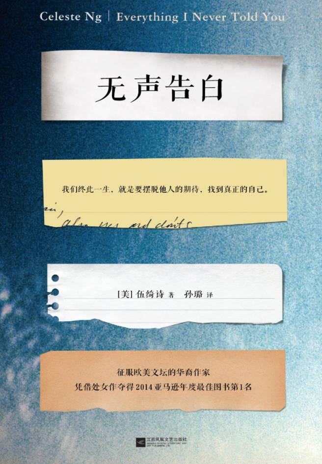

# 无声告白

作者: 伍绮诗[美]

出版时间: January 1, 2015

出版社: 江苏凤凰文艺出版社

字数: 16.7

状态: Finished

类型: 长篇小说

读完的日期: March 21, 2020

> 你永远得不到你想要的，你只是学会了如何得过且过而已。
> 

我觉得每一个想要孩子的人在成为父母之前都应该读一下这本书。

这本书自始至终都在都在贯穿一个道理，”你没有义务活成别人期待的样子，你要活出自己的样子"

作为父母，你很难确定你的孩子是不是真的像他看起来那样听话乖巧，我觉得一个孩子如果对父母的任何事情都百依百顺，这是非常可怕的一件事情，因为他可能并不是自己心里想做这件事，而是“我觉得父母对我有恩，所以我为了让父母开心我才去做这件事情，即使这件事情在我的意愿之外”

这就会导致一个非常可怕的问题，那就是这种压抑是会一点一点的积累的。

当自己的个人意愿得不到满足，却又迫于外界的压力，而不得不做一些自己不想做的事情的时候，这种不适的心理是会日渐积累的。

而当这种难受的心理日渐积累，总有一天会有一件事成为那么一个点，会成为压死骆驼的最后一根稻草，人的承受能力是有限的，何况是一个孩子。

我想我大概能够明白这种感觉，你的心里已经波涛汹涌，心乱如麻了，却不得不在表面表现出特别平静的样子，听从一个人的指令，只是因为这个人是你的父母，你不能违背他。

主角是有反抗的，当他坐上了小混混的那一辆车的时候，他在那个混混的身边感受到了温暖，这种温暖是他在家里永远体会不到的，因为他在他的家里只是一个机器，或者说家里所有人都是机器。

那个时候家里所有的人都只知道指责她，却不知道，这是他的一种想要引起注意的一种方式，他想要被关注，却只是被家人当成了叛逆。

她的心早已经死了，当他为了他的父母的意志，不得不去做出一些自我的牺牲的时候，那个时候他就已经死了，他在这个家里已经感觉不到任何的温暖了。

这个家里没有人不是机器，他的父母的父母，他的上一代人都是这个样子的，这种精神是一代一代传承下来的，只不过到了她这里他没有承受得住。

文中说这种感觉就像是溺水，所以我们的女主角，这个受害者才会在崩溃的时候选择去跳湖结束自己的生命。

当她选择用这种方式结束自己的生命之后，她的父母应该是最困惑的，所以他们的父母才选择了报警，因为在他们眼里他们的女儿一直是一个听话的，品学兼优的家人同学老师眼里的好学生啊，这种这种孩子为什么会轻易的选择结束自己的生命呢？

或许他们永远都不知道。