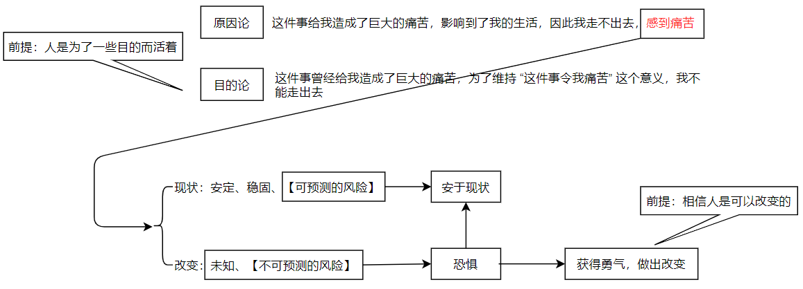
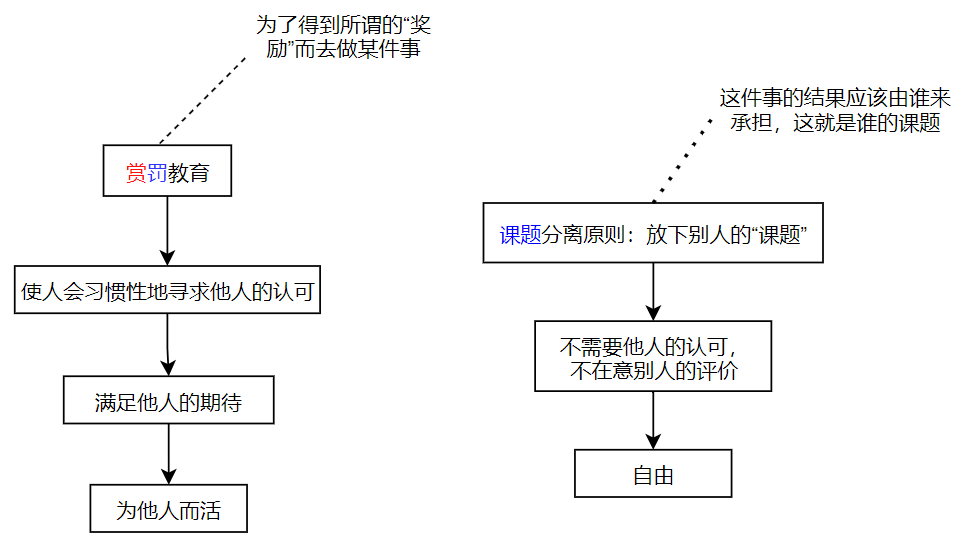

# 被讨厌的勇气

作者:  岸见一郎 / 古贺史健

出版社: 机械工业出版社

字数: 10.8

状态: Finished

类型: 自我提升

读完的日期: Nov 12, 2021

这本书是我无意间看到其内容，看见其现在不常见的对话体，便突然来了兴趣，没想到一发不可收拾，10w字，花了3小时，从晚上10点看到了凌晨1点半，一口气看完了，在夜深人静的夜晚，这本书以其犀利的语言和透彻的思想一遍又一遍地冲刷我浅薄的认知。

> 重要的不是过去，而是你怎么看待过去，而我们对过去的看法，是可以改变的。
>
> 当你急着奔向未来的时候，说明你己经不喜欢现在了。

本书的主线是“阿德勒心理学”

根据我的理解，该学说认为，人都是活在自己的世界里的，自己的生活完全取决于自己的意志，我们感到的所有束缚都是来自于心灵的束缚。我们要做的是改变自己的心态和观念，换一种视角看待生活中的事。

> 人并不是住在客观的世界，而是住在自己营造的主观世界里。
>
> 也许你是在透过墨镜看世界，这样看到的世界理所当然就会变暗。如果真是如此，你需要做的是摘掉墨镜，而不是感叹世界的黑暗。

人是为了意义而活着的，我们会认为，我们所做的任何事都要赋予一个意义，同样的，我们也会赋予我们经历的事情“意义”。

有的人因为以往的一些经历给自己造成了创伤，便会赋予这件事“给了自己创伤”的意义，从自己当下行为的蛛丝马迹中找寻痕迹去对应这种“创伤”，换句话说，我们是为了维持这件事给我们的创伤而消沉，而不是已经过去的这件事给我们造成的影响，使我们消沉。

> 决定我们自身的不是过去的经历，而是我们自己赋予经历的意义

> 重要的不是被给予了什么，而是如何去利用被给予的东西

**注重“目的”，而非“原因”**

同样的，事实上，情绪不是目的，情绪是手段。

拿愤怒来说，愤怒只是表达情绪的一种手段，人在生气的时候也完全可以心平气和地说话，而大多数人采用了“愤怒”这种方式。不是不能发怒，而是没有必要采取发怒这一手段。

**勇气**

> 如果真正地拥有自信，就不会自大。正因为有强烈的自卑感才会骄傲自大，那其实是想要故意炫耀自己很优秀。担心如果不那么做的话，就会得不到周围的认可。这完全是一种优越情结。
>
> 借助权势的力量来抬高自己的人终究是活在他人的价值观和人生之中

弱势群体在我们的社会中拥有一些隐藏的特权，“我都这样了，你还那样对我”，因此人们会夸耀自己的不以使自己显得“特别”，这种人其实是想要借助不幸来显示自己“特别”，他们想要用不幸这一点来压住别人。

要有“甘于平凡的勇气”。

追求理想的人面前通常只有一条路——希望变得特别优秀，脱离“普通状态”，成为“特别的存在”，当他们达不到自己最理想的状态的时候，便会尝试“希望”特别差劲。其原理是一样的，脱离“普通状态”，成为“特别的存在”，这就是所谓的“廉价的优越性追求”。同样的道理，在金庸的小说中，有的人遇见自己心仪的女子，会使自己成为一个理想的人，成为一个强大的存在以引起其注意，也有的人，会刻意表现得非常不堪，这就是所谓的“廉价的优越性追求”，但是，这是一种不健全的态度。

**自由**

> 自由就是，不寻求他人的认可，不在意别人的评价，不害怕被人讨厌。

赏罚式教育下，人们习惯性地寻求他人的认可，希望得到他人的表扬，但是人越得到别人的表扬就越会形成”自己没能力的信念，因为表扬是上级对下级的评价，是有能力的人对没能力的人所作出的评价。

健全的自卑感不是来自与别人的比较，而是来自与“理想的自己”的比较。因此我们要做的，不是肯定自我，而是接纳自我，也不是特别积极地肯定自己，而是“自我接纳”。

> 自我接纳就是，对得了60分的自己说”这次只是运气不好，真正的自己能得100分“，这就是自我肯定；与此相对，在诚实地接受60分的自己的基础上努力思考”如何才能接近100分“，这就是自我接纳。

**人际**

建立横向关系，而不是纵向关系：我们不同，但是我们使平等的，而不是上级对下级之间的操控。

感谢的别人的时候，要感谢别人的“存在”而不是“行为”

> 请你这样想，如果在一起感到苦闷或者紧张，那即使是恋爱关系也不能称之为爱。当人能够感觉到”与这个人在一起可以无拘无束“的时候，才能够体会到爱。既没有自卑感也不必炫耀优越性，能够保持一种平静而自然的状态。真正的爱应该是这样的。

人在舞台上时聚光灯从前面打过来和从后面打过来，我们都看不见前方的观众和后方的舞台，而当聚光灯打到自己身上时，我们才能看清周围的一切。我们的人生也完全一样。正因为把模糊而微弱的光打向人生整体，所以才能够看到过去和未来；不，是感觉能够看得到。但是，如果把强烈的聚光灯对准“此时此刻”，那就会既看不到过去也看不到未来，为什么要看过去和未来呢，把握当下，才是最重要的。

