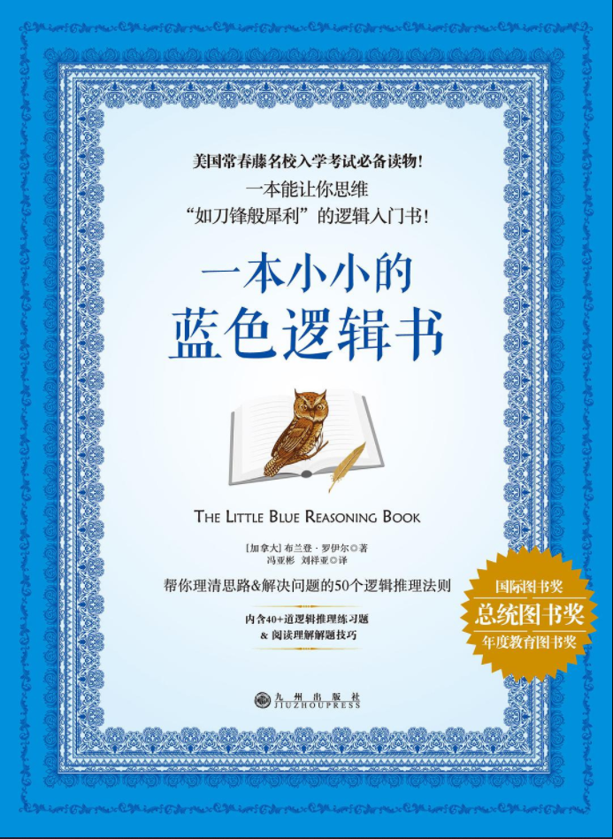

# 一本小小的蓝色逻辑书

作者: 布兰登·罗伊尔

出版社: 九州出版社

字数: 8.907

状态: Finished

类型: 自我提升

读完的日期: October 8, 2021

这本书与其说是一本让人建立起逻辑思维的书，不如说是一本工具书，类似于工具箱，这本书将不同方面的逻辑学概念分门别类放好，整理成了一个一个零散的小点，供读者学习、观看。

在这本书里我几乎没有画什么句子，因为我觉得每一句都是干货。

有时间会重新读的。

