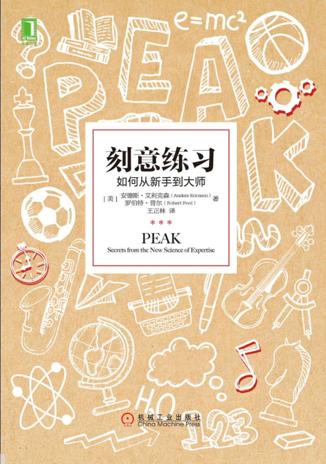

# 刻意练习：如何从新手到大师

作者: Andets Ericsson, Robot Pool

出版时间: November 1, 2016

出版社: 机械工业出版社

字数: 23.896

状态: Finished

类型: 自我提升

读完的日期: May 25, 2021

# 《刻意练习——从新手到大师》

2021.05.11 – 2021.05.24

用了大概14天吧，7.5小时看完了这本刻意练习。

我觉得这本书带给我的最大收获就是，在一定程度上给予了我慰藉。

> 在学习一项技能的最初阶段，先天的因素确实会让人有更快的进步，但是随着阶段的深入，先天因素的影响会越来越小。
> 

> 所谓的“天才”，在他们以自己的“天才”而出名的时候，其实都是经历了很多刻意练习的。
> 

## 内容输出

花了两个星期的时间断断续续看完了这本《刻意练习——从新手到大师》，以下是我凭记忆做出的输出。

**第一次，总体读完：**

本书虽然是讲一种练习方法，但是却花了一半的篇幅来讲一个概念，也是贯穿了本文始终的概念——心理表征。这个概念比较难以理解，因此作者用了大约一般的篇幅介绍什么是心理表征， 目前我还不能十分理解这个名词的含义，还需要多加研究。在我看来，心理表征是一个人对自己所面对的一个领域、所学习的一种技能的总体认知，是一个人对这件事的体系结构的理解程度，是一套方法论，而不是世界观。心理表征相当于我们对我们将要练习的技能的基石，是我们学习一项技能的基础。

刻意练习，练习的是技能，而不是知识，因为知识最终都要为技能服务。这是一套结果导向型的体系，它只关注于“我怎样才能做得更好”，而不是“我怎样才能学得更多”，重点在实践，而不是理论。

关于刻意练习的方法论，作者只花了20%的篇幅来陈述——前50%是让读者形成心理表征这个观念，以便读者明白——我们所作的一切练习，都是为了形成有效的心理表征。如何形成有效的心理表征（如何进行有效的练习？）作者文中给出了一套方法论，也就是刻意练习模型：1.观察行业内最杰出的人，看看他们有什么特质；2.模仿。对杰出的人所作的事情进行模仿，试图按照他们的角度思考问题。3.走出舒适圈，逐步提升练习的标准。4.针对自己最薄弱的部分进行练习，只练习自己薄弱的部分。（5…..忘记了，看完第二遍再写）

在本书的最后，作者利用刻意练习模型来解释了“天赋”这个概念。

**第二次：提出问题，带着问题再次读书，目的只在于解决提出的问题：**

1. 什么是心理表征？
2. 整理刻意练习的方法论。
3. 创建笔记框架模型：自己的想法 + 引用作者原话。

## 第二次笔记

刻意练习的目的是创造我们的潜力

有目的的持续进行练习

> 在任何行业或领域之中，最有效的和最强大的那类练习，都通过充分利用人类的身体与大脑的适应能力，来逐步地塑造和提升他们的技能，以做到一些过去不可能的事情
> 

在练习的过程中我们应该走出自己的舒适区，一旦有某一次练习的结果达到了我们预期的水平，就要给自己增加难度或者训练量

所以，刻意练习的进步是永无止境的。

我们应该杜绝“天真的练习”，也就是 `~~反复地做某件事情，并且指望只靠这种重复就能提高自己的技能或者水平~~`

**什么是“有目的的练习”？**

- 具有定义明确的特定目标
    - 定义明确的目标可以有效地引导我们的练习
- 保持专注
- 包含反馈
    - 我们的练习需要反馈来指出我们还有哪些缺陷以及为什么会有这些缺陷
- 走出舒适区
  
    > 对于任何类型的练习，这是一条基本的真理：如果你从来不迫使自己走出舒适区，便永远无法进步
    > 
    
    > 一旦你已经达到了这种令你满意的技能水平，而且能做到自然而然地表现出你的水平，无论是开车、打网球还是烘焙，你就已经不再进步了。
    > 

**遇到了瓶颈怎么办？**

- 从不同的角度想办法，而不是做更难的事情
  
    > 不管什么障碍，越过它的最好办法是从不同方向去想办法，这也是这种方法需要导师或教练的一个原因。有些人已经熟悉了你可能遇到的障碍，于是，可以为你提供克服障碍的方法
    > 
- 并没有达到你的极限，而是动机不足，也就是说，你需要动力

**什么是心理表征？**

原文中这样说：

> 心理表征是一种与我们大脑正在思考的某个物体、观点、某些信息或者其他任何事物相对应的心理结构、或具体或抽象
> 

文中说的有些抽象，我试图把它解释地具体一点，所谓心理表征，就是存储在我们大脑中的，对某一个领域总体认识的长时记忆，这种总体认识不是指大概的认识，而是一种像地图一样的从整体信息到局部细节事无巨细的展现在脑海中的认识或结构，我们可以从心理表征中读取，这种事物的每一个方面，也可以通过借助外部信息来进行完善。这种整体认识的内部也不是独立的，而是相互之间充满联系和依赖，并且我们自身可以利用这种联系和依赖对自己的心理表征进行验证，使其相互支撑。

作者在书中对现存的行业进行了分析，他发现，能够通过一系列有效的训练来达到一个比较高水平的行业或者技能，他们总是有着一些相同的特点：

- 对“好的表现”有标准的定义，也就是说，“好”与“不好”能被客观评价。
- 具有足够的竞争性。
- 已经得到了长足的发展。
- 有专业的人员担任导师和教练的工作。

作者认为：在早期的学习中，所谓的“天赋”确实会给练习带来比较快速的提升，但是随着水平的提升，天赋的差异所带来的影响会变得越来越小，最后让人不断进步的，一定是更加完善有效的刻意练习。

**刻意练习的特点：**

- 有一套完整的训练方法来提高自己的能力
- 发生在人的舒适区之外
- 有明确循序渐进的目标
- 包含反馈（激励）
- 能够产生心理表征，又依赖于心理表征，两者相辅相成
- 能够从过去的经验中推断出以后要从那些方面进行改进

摒弃以下错误思想：

- ~~某人的能力收到基因的限制，比如“我数学不好，所以我不会做”~~
- ~~如果你用足够多的时间做某件事，你一定会更擅长~~
- ~~努力就能提高~~

找出行业中接触的人，准看他们做了什么，才能使他们在人群中鹤立鸡群

刻意练习模型：

1. 找一个好的导师
   
    > 要忽略那些关于他的课程多么有趣的评论，着力寻找那些对学生取得的进步以及已克服的障碍进行特定描述的评论
    > 
    1. 没有导师怎么办？
       
        > 刻意练习，其标志是你努力去做一些你无法做到的事情，去完成一些处在你的舒适区以外的任务…为了提高，我们必须自己创造机会
        > 
        
        **模仿。**
        
        > 他们找来一些带字幕的相同的英文电影，一遍又一遍地观看，在观看的时候把字幕遮住，努力去理解片中人物所说的话。为了检验他们的理解，看了许多遍之后，他们再把字幕显示出来。通过一再倾听同一些对话，他们理解英语的能力比起简单地观看许多不同的电影来练习，得到了更快的提高
        > 
2. 保持专注和投入
   
    > 如果你想提高棋艺，只和别人下棋，无法提高；你要单独研究特级大师的棋局，才可能提高。如果你想提高掷飞镖的技能，到酒店里和朋友玩，然后让输了的一方掏钱，水平不会提高；你只有花些时间单独练习，致力于复制你投掷成绩最好的那些投掷动作，才能提高。你可以系统地改变瞄准的飞镖靶上的不同点来提高你的控制水平。如果你想提高自己的保龄球技能，每周星期二晚上和你的保龄球联盟球队在一起玩，对你没什么帮助。你需要花一些时间和高水平的队友在一起，理想的情况是，致力于做一些艰难的球形排列，以便能够准确地控制球的走位，才是关键。依此类推。要记住：如果你在走神，或者你很放松，并且只为了好玩，你可能不会进步
    > 
    1. 一旦你发现自己无法保持专注了，应该怎么做？
       
        > 专注和投入至关重要，因此，制订明确的目标，把练习课程的时间缩得更短，是更加迅速地提升新的技能水平的最佳方式一旦你发现自己再也无法有效地专注于练习了，那便停下来
        > 
3. 创建有效心理表征
   
    > 专注（focus）、反馈（feedback）以及纠正（fix it）。将技能分解成一些组成部分，以便反复地练习，并且有效地分析、确定你的不足之处，然后想出各种办法来解决它们
    > 
    
    **反馈**
    
    > 不论你在努力做什么事情，都需要反馈来准确辨别你在哪些方面还有不足，以及怎么会存在这些不足
    > 
    
    纠正
    
    > 也就是说，通过研究大师的作品，努力从记忆中复制它，然后将复制品与原始作品进行对比，以发现其中的差别，并予以纠正。我们只有努力去复制杰出人物的成就，失败了就停下来思考为什么会失败，然后再去复制，一旦失败了，再次停下来思考原因，如此一而再再而三地尝试，才能创建有效的心理表征
    > 
4. 跨越停滞不前的阶段
   
    > 要越过这种停滞阶段，最好的办法是以新的方式挑战你的大脑或身体。
    > 
    
    **攻克自己的弱点**
    
    > 为了弄懂这个问题，你得想办法稍微逼自己一下，但不要逼得太狠，只要使自己稍稍超出正常状态便可以。这通常会帮助你搞清楚自己的“停滞点”在什么地方
    > 
5. 保持自己的动机
   
    加入团体
    
    > 将对同一个事情感兴趣的人们聚集起来，或者吸引他们加入一个现有的团体，能够增强自己的动机。
    > 
    
    **设置目标**
    
    > 将漫长的旅程分解为一系列的可控的目标，并且每次只关注其中的一个。
    > 

成为杰出人物的三个阶段：

1. 产生兴趣
   
    > 未来的杰出人物往往遵循一般的规律，那便是：到了他们成长过程中的某个时刻，他们对某一特定领域或行业格外感兴趣，并且表现得比其他同龄孩子更有希望成就一番事业
    > 
2. 变得认真
   
    > 这种能力的特点究竟是什么？以及，什么样的训练使那些能力成为可能
    > 
3. 投入
4. 创新（创新也离不开练习）

**用刻意练习模型解释“天才”：**

潜能可以被构筑

> 对于刻意练习，我们的目标不仅仅是发掘自己的潜能，而且要构筑它，以便从前不可能做到的事情变得可能做到。这要求挑战体内平衡，也就是走出你的舒适区，并迫使你的大脑或身体来适应
> 

从长远来看，占上风的是那些练习更勤奋的人，而不是那些一开始在智商或者其他才华方面稍有优势的人

练习是决定某人在某个特定领域或行业中最终成就的唯一最重要因素，因此，如果基因在其中发挥作用，那么，它们的作用会慢慢消失，而以下因素更突出的作用会显现出来：他有多大的可能性从事刻意练习，或者那种练习可能多么有效。以这种方式来看问题，会从完全不同的视角来观察基因的差异

杰出人物通过年复一年的刻意练习，在漫长而艰苦的过程中一步一步改进，终于练就了他们杰出的能力。没有捷径可走