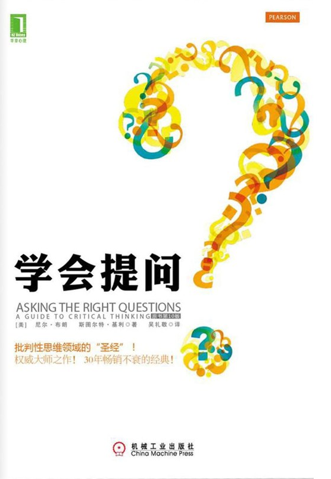

# 学会提问

作者: 尼尔·布朗

字数: 14.115

状态: Finished

类型: 自我提升

---

这本书并不是教人如何把对方问住的，而是教人如何从对方的言论中发现问题，提问自己，培养自己独立思考的能力的。

这本书的标记我只标记了一半，因为我觉得这本书太有用了，以至于每一套理论，每一句推理都让我想要全文背诵。

对于一个比较没有独立思考能力的人来说，这本书能够帮助这个人快速建立起一套分析一段话的方法论，就好像提供了一套公式，让我们都能根据某些方法论找出我们在日常生活中听到和看到的一些言论中的漏洞。

这本书我打算买实体书，研读。

以一小段一小段的方式呈现了问题的分析过程，从而一步一步帮助读者建立语段分析方法论。

曾经看过《非暴力沟通》，我觉得在某种程度上，这两本书是可以相提并论的，我觉得这两本书是可以相辅相成的。

学会提问，本质上是学会思考。练习提问的能力，本质上是在自己的脑海中建立起逻辑分析和推理的过程。

学会沟通，学会说话，本质上也是学会思考，练习说话的能力，也是在练习自己的应变能力。

以我目前的思维还不够写一篇足够详实流畅的文章来对这本书进行具体的介绍，先这样吧，下次一定。

---

> 我们生活的这个世界是嘈杂、混乱的，更糟糕的是，那些想说服我们的人，在努力塑造我们的行为习惯时并未做到光明磊落。他们所说的话至多不过是真假参半。

> 我们倾听他们，是为了构建出自己的答案，而不是听了他们的话以后，马上就按他们说的去做

> 批判性思维包括：①要能意识到它们是一整套环环相扣的关键问题；②有能力在适当时机以适当的方式提出和回答这些问题；③积极主动地使用这些关键问题的强烈渴望

> 我们要培养的习惯，就是问一问自己：我为什么要像现在这样想

> 所谓“晕轮效应”（halo effect），是指我们通常会先认识到一个人身上所具有的积极或消极方面的特征，然后就把这些特征和这个人的其他一切都联系起来
> 所谓“确认性偏见”，就是指我们总是倾向于只把那些可以确认我们既有信念的证据当成可靠证据

> 描述性论题是指针对过去、现在或将来的各种描述的精确与否提出的问题
> 规定性论题是指针对什么该做什么不该做，什么是对什么是错，以及什么是好什么是坏所提出的问题

> 你相信一个陈述（结论），是因为你认为它是由其他观点支撑的，这就是在推论。当人们从事这一思维活动时，他们就是在进行论证，而论证得出的结果就是结论

> 只有在你找到支撑结论的各种理由以后，你才能评判这个结论的价值

> 确定一个人的论证结构的时候，你应该把每一个好像被作者拿来支持其结论的想法都当成理由，即使你并不相信它其实能为结论提供多大的支持

> 结论本身并不是证据，它是一个由证据或其他信念支持的信念

> 我们常常会误解所读到的文章或所听到的言论的含义，因为我们总以为很多词的含义都显而易见

> 我们在读书、听讲的时候，一定要强迫自己去寻找那些意思不明确的词或短语，否则就会抓不住要领。我们说一个语或短语意思不明确，是指它的意思在我们所考察的论证的上下文语境里让人捉摸不透，需要有进一步的解释，我们才能判断论证的过程是否恰当

> 一个词或短语越是抽象，人们就越有可能对其做出多重解读

> 因此，在很多论证中，你并不能从字典里找到合适的定义，而上下文语境又不能让意思变得清晰起来。此时，还有一种方法可以帮你发现这个词可能存在的其他含义，那就是尽量在脑海中想象这个词所代表的具体景象，如果你想象不出来，那你很可能就找到了一处重要的歧义。我们可以用下面这个例子来测试一下

> 当别人要我们解释为什么某个特定的行为会发生，我们常常忍不住想要隐藏自己对很多复杂因果关系的无知，干脆给那种行为或贴个标签或起个名字。然后，我们错误地以为，因为我们知道那个标签或名字，我们就知道事情的起因

> 谬误的种类
> [1] 人身攻击型谬误：指针对个人的人身攻击，而不是直接反驳其提供的理由。
> [2] 滑坡谬误：设想采取提议的步骤会引发一连串不可控的不利事件，而实际上却有现成的程序可用来防止此类连锁事件的发生。
> [3] 追求完美解决方案谬误：错误地认为因为尝试某种解决方案后还有遗留问题未解决，那么这种解决方案根本就不该采用。
> [4] 诉诸公众谬误：通过引述大部分人都持有这一观点的说法，试图证明某个断言有道理；错误的以为大部分人喜欢的事就是可取的。
> [5] 诉诸可疑权威谬误：引用某一权威的话来证明结论，而该权威对这一论题并没有特别的专门知识。
> [6] 诉诸感情谬误：使用带强烈感情色彩的语言来分散读者或听众的注意力，让他们忽视相关的理由和证据。常被用来加以利用的情感有：恐惧、希望、爱国主义、怜悯和同情。
> [7] 稻草人谬误：歪曲对方的观点，使它容易受到攻击；因此我们攻击的观点事实上根本就不存在。
> [8] 虚假的两难选择谬误：当现实中存在两种以上的选择时，却假想只有两种选择方案。
> [9] 乱扣帽子谬误：错误的以为因为你给某个特定事件或行为起了个名字，你就合理解释了这一事件。
> [10] 计划谬误：人们或者机构倾向于低估他们完成一项工作所需的时间，尽管有无数过去的经验显示他们曾一直低估完成某件事所需要的时间。
> [11] 光环效应谬误：使用模糊、引发人们强烈感情认同的品德词汇，使我们倾向于同意某件事而不去细查其理由。
> [12] 转移话题谬误：一个不相干的话题被插进来将注意力从原来的论题上转移开，通过将注意力从当前的论证转移到另一个论题上，以此来帮助赢得这次论证。这个例子中的谬误顺序如下：①甲主题正被讨论；②将乙主题介绍进来，它长得好像和甲主题有关，而实际上两者并不相干；③甲主题被置之不理。
> [13] 循环论证谬误：指在论证过程中已假设自己的结论成立的论证
