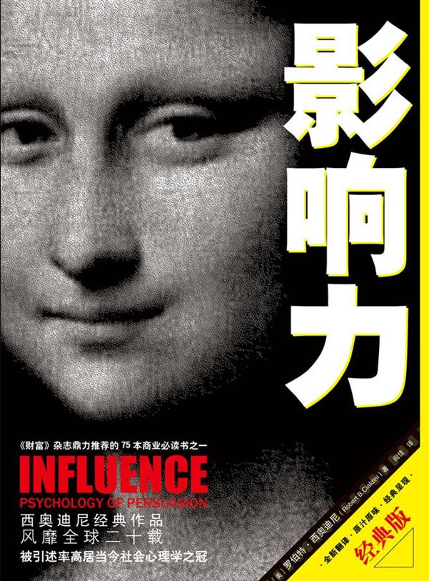

# 影响力

作者: 罗伯特·B·西奥迪尼

字数: 28.907

状态: Finished

类型: 自我提升

读完的日期: Nov 8, 2021

阅读之前并没有想到这本书能够给我带来这么大的启发。这本书我非常推荐，它使我成为了更清醒的人。

这应该是一本营销方面的书，书中提到了很多能够影响他人的方法，在本书中首先学到的应该是如何在别人精心设计的圈套中进行“自我保护”，然后才能去想如何利用书中的理论去影响别人。

本篇文章与其说是读后感，不如说是对文章内容的一个摘要和简单整理。

书中提到，我们频繁地、机械地运用互惠、承诺和一致、社会认同、喜好、权威以及短缺原理，因为这里的每一条原理都可以相当可靠地提示我们，什么时候说“是”比说“不”更加明智。

> 文明进步的一个标志，就是人们可以更加频繁地以不假思索的方来行动。
>
> ——阿尔佛雷德·诺斯·怀特海德

我们当今世界的文明无疑是一个高度发达的文明，但是如今的社会中，人们却越来越浮躁、越来越想要“快”，这种越来越急于求成的心态导致了人们越来越不假思索地对一个问题作出回答，我认为这是非常可怕的事，这给了很多别有用心的人可乘之机。

**思维惯性。**

他们会利用人的思维惯性，挖掘人身上的漏洞，从人的身上谋取利益。

人的许多行为都是有规律的，当有人有意无意触发了身上的一个“开关”，人们就会按照“剧本”行事。

> 当我们请别人帮忙时，如果能够阐明自己之所以需要帮助的理由，得到帮助的可能性会大大增加

这是因为人们都喜欢有理有据的东西。

**诉诸常识。**

此外，当人们在一个领域中并不了解的时候，便会诉诸该领域的“权威”，也就是专家，当人们找不到专家时，便会诉诸于自己的所谓的“常识”

> 当他们挑选绿松石珠宝时，依赖的是“昂贵=优质”的公式。有很多研究都表明，当人们对一件商品的质量没有把握时，的确经常使用这个公式
>
> 除了“昂贵=优质”的公式外，我们的脑子里一定还有一个“便宜=低劣”的公式。其实，就是在我们的语言里，“便宜”这个词也不仅仅指价格低，它还含有质量比较劣等的意思
>
> 当人们觉得事不关己时，他们完全依赖“专家的话一定是对的”这一规则，说服他们的不是讲演本身，而是讲演者在教育领域的造诣和地位；而当人们会受到这一主张的影响时，他们的态度就不一样了。他们基本上忽略了讲演者的专家身份，说服他们的是讲演本身的合理性

**对比原理。**

> 房地产公司总是保留着几栋很破败的房子，却给它们标上很高的价钱。他们当然没有打算把这些房子卖给顾客，拥有这些房子的目的是把它们出示给顾客看，好让那些公司真正想要出售的房地产对比之下显得更有吸引力

也就是说，对比原理告诉我们，先让顾客看到比较贵的商品，再让他看稍微贵一点的商品时，后者会显得不那么贵了。

这也告诉了我们一个小技巧：先说好消息，会让坏消息显得更坏，而先说坏消息，会让好消息显得更好。

书中提到了一种策略——拒绝-退让策略

> 极端的要求要先讲，但也不能太极端。这个简单的技巧可以称为“拒绝—退让”策略。假定你想要我同意你的某个请求，一个可以增加你的胜算的办法就是先提出一个比较大的、我极可能会拒绝的请求。然后，在我拒绝了这个请求之后，你再提出那个小一些的、你真正感兴趣的请求。如果你的请求提得很巧妙，我就会认为你的第二个请求是你做出的一个妥协，因而会觉得我也应该做出一个妥协。而我眼前就有一个这样的机会——我可以同意你的第二个请求。

**互惠原理。**

> 给予是一种义务，接受是一种义务，偿还也是一种义务.
>
> ——马塞尔·毛斯

> 当一个人将财物等资源分给他人时，其实并没有真正地将这些东西失去。这种现象的结果就是，那些以一方向另一方提供资源为开端的交易变得容易起来，错综复杂而又井然有序的援助、送礼、防御和贸易体系也成为可能，从而给社会带来了巨大的利益

由此看来，即使是一个不请自来的好处，一旦被接受，也会制造出一种负债感，因为我们从小受到的教育告诉我们，如果一个人对我们采取了某种行为，我们也应该报以类似的行为。

这种负罪感即使带来这种负罪感的东西非常微不足道甚至能够引起你的厌恶，但是只要你接收了这个“礼物”，你就会就如同芒刺在身，浑身都不自在。而我们之所以会痛痛快快地给出比我们所收到的多得多的一切，就是为了尽快使自己从这样的心理重压下获得解放。

这就是互惠原理的本质：尽管一种礼物根本没人想要，尽管人们一有机会就会把这个礼物扔掉，这个礼物在互惠过程中还是一样有效。

而很多营销手段就利用了这一点。

先送你一枝花或者一个水杯，然后让你办理某种业务；先让你免费试吃，再让你决定要不要买单等等。

不过，只要不给别人任何一点运用互惠原理的机会，自然也就可以避免与互惠原理的正面冲突。比如说，只要我们总是拒绝他人的恩惠和妥协，人家便无法把回报的义务强加到我们头上来

> 如果他人最初的提议是我们想要的，我们就接受它，但我们接受的只是这个提议本身，而不是他人想要这个提议去扮演的角色。如果一个人给了我们一个好处，我们不妨接受它，同时意识到我们将来有责任回报他。

**承诺一致原理。**

> 那些违背自己的意愿而服从的人，他们的想法一点也没变
>
> ——萨谬尔·巴特勒

我们的思维定势是：我们要保持自洽，也就是说，我们前后说的话要一致。但是这也导致了我们在有意无意说出了一些不合我们真正想法的话时，我们会时不时地欺骗自己，好让我们的信仰或想法与我们已经做出的决定或采取的行为一致。

> 刻板地保持一致就像一堵厚厚的城墙。当我们躲到这堵城墙后面的时候，理性的袭击就对我们无可奈何了

我们在确立了自己的一个想法的时候，为了使自己不会后悔，我们常常会说出诸如”我就是这样想的“之类的话来麻痹自己，正如为自己树立了一道城墙，我们躲在了后面，便可以毫不费力地继续我们的行为了。

我们如何防范呢？

> 即使是对一些看起来很不起眼的要求，我们也要保持警惕。答应这样的请求不仅会增加我们将来答应更大的有关请求的几率，而且也会增加我们答应更大的不相关请求的几率。

不过，在某种程度上，我们是可以利用这一原理的，例如，当和一个人相约的收，不要再说`“如果你改变计划请给我打电话”`，而是问`“如果你改变计划的话会不会给我打电话？`”然后停下来等对方回答。这样一来，对方就会因为情面或者其他的原因，理所当然地回答“会”，这样，在他不能守约的时候，你一定能够得到他的消息。

> 铜迦部落中眼里噙着泪水看着自己十岁的儿子在“神秘院”冰凉的地上瑟瑟发抖地度过漫漫长夜的父亲，在地狱之夜中一边鞭挞自己兄弟会的小兄弟，一边不时地爆发出神经质大笑的二年级学生，这些人都不是虐待狂，他们所做的一切都是一个团体要生存下去不得不采取的行动。虽然听起来有些荒谬，但这样的行为却能让未来的成员觉得这个团体更有价值和吸引力。只要人们仍然珍惜并且相信他们努力奋斗得来的东西，这些团体就会继续煞费苦心地安排这些既繁琐又艰难的加入仪式

> 当我们在没有外界压力的情况下做出选择时，便会在心中为这一选择负起责任来。而一件诱人的奖品正是一种来自外界的压力。它虽然能够让我们采取某一行动，却不能让我们从内心深处相信这一行动，因此我们也就没有真正地做出承诺。一个强大的威胁也是如此，虽然它让我们乖乖地屈服，但却不太可能让我们心悦诚服

> 汽车推销商的低球策略通常是这样的：他们先给顾客一个听起来很不错的条件，引导他们做出一个正面的决定，然后再把他们的条件中真正诱人的部分拿走。如果我对低球策略的实质的判断是正确的，那么一种稍微不同的抛低球的方法也应该有效：我先提出一个很好的条件，让对方做出那个关键的决定，也就是承诺，然后再在最初的提议上加上一个不太令人愉快的条件。因为低球策略的关键在于让人们坚持自己先前的决定，即使在条件有了变化、这个决定已经不是那么明智以后也不改变立场。那么，不管是一个好的条件被拿走了还是一个坏的条件被加了上来，这一点应该还是一样的

如何破局？

直言不讳地告诉对方，“我知道你们在干什么”

**社会认同原理。**

> 在大家都用同样的方式思考的地方，没有人思考得很深刻。
> ——瓦尔特·李普曼

社会认同原理指出，我们进行是非判断的标准之一就是看别人是怎么想的，尤其是当我们要决定什么是正确的行为的时候。我们认为某种理念正确的人越多，这种理念就越正确。

> 一般说来，当我们对自己缺乏信心时，当形势显得不很明朗时，当不确定性占了上风时，我们最有可能以别人的行为作为自己行动的参照

> 在通过观察他人来消除我们的不确定性的过程中，我们很可能忽略了一个细小但很重要的事实，那就是他人可能也正在观察中寻找社会证据。特别是在形势模糊不清的时候，每个人都希望看一看别人正在做什么，这种倾向可以导致一种被称为“多元无知”的有趣现象

街边有人发生意外，旁观者都在冷艳围观，却无一人上前；歹徒当街行凶，周围路人无一人阻拦，这一切都是因为
“多元无知”现象——当你在想着“别人会怎么想”的时候，别人也同样有着这种想法。

> 广泛宣传的暴力行为，不论是针对自己还是针对别人的，都极有可能传染给其他类似的人，造成非常有害的影响

> 人们会对自己在吃东西的时候所经历的人和事会更加喜爱

> 在大多数情况下，教室种族融合之所以会加深偏见，是由于大家都是将其他种族成员作为竞争对手来相处的。

对于上述情形，作为学生的我深表赞同。在一间教室里能够按照积极程度分为三类人：积极举手回答问题的、始终沉默的、不主动举手但也不排斥回答问题的。

回答问题的机会只有一次，第一类人中势必会互相敌对，若是在第2、3类人中有人回答了问题，那么会引起所有第一类人的“敌对”，而2、3类人也必然会认为第一类人装腔作势。

敌对关系就此形成，牢不可破，在教学情况不变的情况下，教室的关系只能恶化，不会好转。

所以一些教育学家近期提出了“反转课堂”的概念，每一个人掌握着一块知识，大家轮流分享，共同讨论，消除课堂上的敌对关系。对于这种课堂方式，我还是比较期待的。

---

插一个题外话，最近EDG胜利的消息火遍全世界，尤其是刺激着中国青年的神经，他们中的所有人真的是为了EDG的胜利而欢呼吗？这里引用书中的几段话，进行批判性思考。

> 著名作家依萨克·阿西莫夫在描述我们观看一场比赛的反应时说过这样的话（Asimov，1975）：“当所有其他的因素都一样时，你会为与你同性别、同文化、来自同一个地方的一方加油……而你想要证明的是，你比其他人要优越。你为之加油的那个人就是你的代表；当他（或她）得胜的时候，你也赢了。”当我们从这个角度来看问题时，一个观看比赛的体育爱好者的狂热情绪就比较容易理解了。一场比赛并不仅仅是以它固有的表现形式或艺术性来为我们打发时间或供我们欣赏，而且也是在让我们以自身为赌注来为一场比赛的输赢打赌。正是由于这个原因，观众们才会对为自己的家乡赢得胜利的人如此热爱和感激；也是由于这个原因，他们才会对招致体育比赛失败的运动员、教练和官员如此粗暴和残忍。
>
> ......
>
> 正是由于所有这些原因，我们总是煞费苦心地控制我们与胜利者和失败者之间的关系的能见度，彰显正面的联系，掩盖负面的联系，以使旁观者对我们有更高的评价因而更喜欢我们。这样做的方法很多，但最简单也最常见的还是使用不同的代词。比如说，你有没有注意到，在家乡的运动队赢得了一场比赛之后，狂热的观众经常都挤到摄像机的镜头前，把食指竖得高高的，叫道，“我们是第一！我们是第一！”请注意他们从来不说“他们是第一”或甚至“我们的球队是第一”。他们所用的代词是“我们”，他们想要表现的是一种与得胜的球队近得不能再近的关系。

在我们的社会中有这么一群人，他们缺乏对自我的正确认识，在内心深处对自己的价值估计过低。这种感觉使他们不是从自身的成就，而是从自己与别人的成就的关联中，来寻找荣誉和尊严，“我认识一个人，他多么多么牛逼”，“我一个兄弟是哪哪哪毕业的，多厉害”，诸如此类的。我认为，这些人的行为都有一个非常可悲的共同点——他们的成就感都来自自身之外。

自己的内心不够强大，便只能从与自己有关的人身上寻找那所谓的“成就感”。

更可怕的是，为了“使自己看起来更牛逼”，他们还会“夸大自己口中那个与自己有关的人”的成就，给别人造成困扰。

可怜。可悲。

**喜好**

书中提到，我们对一个人产生喜好的方面有以下几种：外貌、相似性、称赞、接触与合作。

> 有些研究人员提出的证据表明，外表溧亮的人意识到他人对自己的正面评价不是基于他们真实的个性和能力，而是由于外表吸引力的光环效应

这大概就是有些外貌不错的人，却非常自卑的原因。

> 不要试图去识别所有那些导致我们好感的因素并防止它们起作用，而是把注意力放在自己是否已经对一个依从业者产生了过多的好感这一事实上。如果我们发现自己对一个依从业者的喜爱已经超出了正常情形下应有的程度，那就是我们警觉起来保护自己的时候了

**权威**

在对人们施加影响的过程中，一种权威的标志正如权威本身一样有效，那么权威的标志有什么呢？

头衔、制服、外部标志等。

>  他们有时候犯错误并不是由于服从了一个真正的权威，而是服从了一个最容易假冒的权威标志——头衔

当有人自称专家推销产品时——

> 问自己两个问题
>
> 1. 这个专家是不是真的专家：权威的资格+这个资格与我们的问题是否有关
> 2. 这个权威会不会对我们说真话

**物以稀为贵**

当某种东西变得比较少、我们想获得它的自由受到限制时，我们就会对它产生一种更强烈的欲望

因此，不要被生活中各种各样的倒计时吸引——那都是骗人的。

时间不早了，先这样吧。
