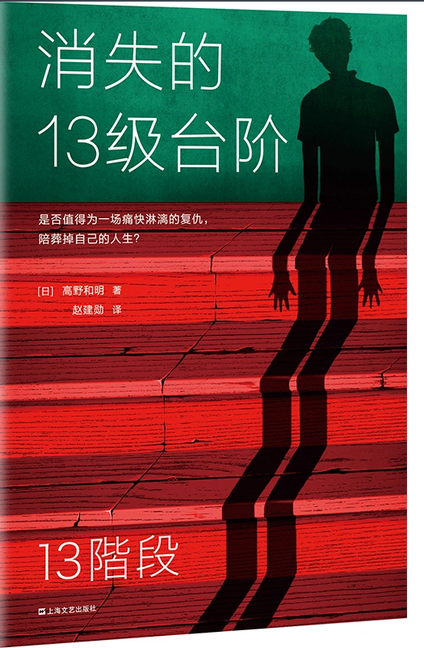

# 消失的13级台阶

作者: 高野和明[日]

出版时间: 

字数: 15.89

状态: Finished

类型: 悬疑

读完的日期: October 13, 2021

表面的悬疑推理小说，皮囊下藏的却是对刑罚、对死刑相关制度的探讨。

在读这本书以前，我对法律的了解仅仅是止步于“法庭”、“判刑”等一系列抽象的概念，这本书可以说让我了解了一个案件背后的曲折流程，也让我见识到了在一些被宣判死刑的犯人背后，有多少心酸和无奈。

世界充满了对弱者和善者的恶意。

守法的良善公民总是在承受着这个世界最大的恶意。

正如这本书封面的slogan

*“是否值得为了一场痛快淋漓的复仇，陪葬掉自己的人生？”*

法律只能通过惩罚“所谓的坏人”来减少“坏人”的出现，而不能在“好人”受到伤害之前阻止伤害的发生，而“好人”在受到“坏人”的伤害的时候是不能反击，报复的，否则自己也将成为“坏人”。

冤冤相报何时了。

这不只是法律的bug，法律已经通过一些规定来对一些人产生威慑，从而避免这种情况的发生了，真正的变数在人，在人的思想和意志。

人是复杂的。

所以我认为，解决这种问题的根本方法，在教化。

这本书也让我体会到了立法的不完善能给多少人带来多大的损失，这些损失都变成了催生出完善法律的养料。

完备的法律是用一个一个的案例堆起来的。

---

> 依然留在那里的芳枝说话了：“也许我们言辞过于激烈，对不起。但是有一点请你们理解。那个事件发生以后，我们每天就像在地狱里过日子。葬礼都没准备好就开始接受警察的调查，各家媒体纷纷前来采访，门铃从早到晚响个不停……那些高叫着报道自由的人，像凶手一样向我们扑过来。我和我丈夫身体都被搞垮了，一起住进了医院。当然，医疗费得自己负担。可是，那个受伤的凶手的手术费、治疗费，却全部由国家负担!” 眼看芳枝眼眶里含满的泪水就要滚落下来了，纯一把脸转到了一边。 “请原谅我说话语无伦次。我只是想让你们明白，在这个国家里，你刚成为恶性犯罪的受害者，整个社会突然就成了你的加害者。而且无论他们怎么欺负你这个被害人，也没有人来向你谢罪，也没有人承担责任

> 因为南乡的问题触及了跟刑讯逼供一样的，可以产生冤案的结构性问题。在日本的法庭上，警方搜集到的证据，无须全部公开，也就是说，警方认为没有必要公开的证据，可以不公开。如果警方故意将某些证据视为没有必要，证明被告人无罪的证据就有可能被隐瞒起来

> 法律这个东西，常常有被权力一方恣意滥用的危险。如果只考虑证据，法院只能认为他是共犯，也只能宣判处以被告人死刑

> 法律是公正的吗？是平等的吗？无论是有地位的人还是没地位的人，无论是聪明的人还是不聪明的人，无论是有钱的人还是没钱的人，只要他是坏人，只要他犯了罪，都能受到公正的审判吗？我杀死佐村恭介的行为是犯罪吗？至今连这个都搞不明白的我，是一个不可救药的坏透了的恶人吗？ 在法律的世界里，有所谓一事不再理的原则。即受到一次判决确定了刑期的被告人，不会因同一事件再次受到审判