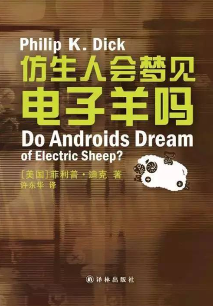

# 仿生人会梦见电子羊吗

作者: 伍绮诗[美]

出版时间: January 1, 1968

出版社: 

字数: 12.7

状态: Finished

类型: 科幻小说

读完的日期: Nov 04, 2021

广为流传的“赛博朋克”的始祖，读起来却没有给我一种惊艳的感觉，或者是我不太理解“赛博朋克”

去百度查了一下这个关键词。

> 赛博朋克类作品背景大都建立于“低端生活与高等科技结合”的基础上，通常拥有先进的[科学技术](https://baike.baidu.com/item/科学技术/3348043)，再以一定程度崩坏的[社会结构](https://baike.baidu.com/item/社会结构/82310)做对比；拥有五花八门的视觉冲击效果，比如街头的霓虹灯、街排标志性广告以及高楼建筑等，通常搭配色彩是以黑、紫、绿、蓝、红为主，但霓虹灯等只是其中标志，并不是所有霓虹灯相关的都称为赛博朋克。故事框架是以[社会秩序](https://baike.baidu.com/item/社会秩序/6157440)受到[政府](https://baike.baidu.com/item/政府/1416952)或[财团](https://baike.baidu.com/item/财团/436908)或秘密组织的高度控制，而主角利用其中的漏洞做出了某种突破。
>
> ——百度百科《赛博朋克》

赛博朋克的特点：

- 低端生活与高等科技
- 崩坏的社会结构
- 强烈的视觉冲击效果
- 主角试图冲破固有的垄断的社会秩序

**书名解读**

`“仿生人”`：人工智能 -> 被流水线生产出来的“人”

`“梦”`：有两种解释

一种说法是，“梦” 是代表“梦想”，什么梦想呢？平等。在们故事中人们为了在火星发展更快，制作了仿生人为“原生人”工作，仿生人与人基本没有区别，只是没有同情心。在人的框架体系中，仿生人的任务就是工作，然后报废；但是仿生人有自己的判断能力，逃回了地球，他们想要拥有和人一样的地位。于是“梦”可以被解读为“梦想”；

另一种我自己认为的想法，“梦”是指仿生人的自我意识，我认为“移情能力”，也就是同情心，是作为人的不可或缺的一种心理状态，没有这种状态，就不会成为一个真正的人。文中的仿生人是冷血的，不会产生同情心的。却仍旧想要与人类平等的权力和地位，我认为是不太可能的。

`“电子羊”`：宠物 -> 情感

本文中，活着的动物几乎灭绝。但人是社会性动物，人是需要情感寄托的，动物的灭绝就导致了人们为了寻找情感的寄托，加之自己较低的生活水平，导致了社会上的一些人只能购买电子宠物作为情感寄托。

你可以通过设定一些参数，让你的宠物更加偏向于你自己的一些喜好，你可以向别人炫耀说自己的宠物有了哪些活动或者变化因为在外形上，电子宠物和真实的宠物并没有什么区别——由于价格因素——真实的宠物是社会地位的象征，你可以以此满足自己的虚荣心，但是你永远欺骗不了自己——就像仿生人可以模仿人，可以变得越来越像“人”，但是仿生人永远不能称之为真正的“人”，不会有真正的“人”的情感。

仿生人能梦见电子羊吗（仿生人能够与正常人有着相同的社会地位吗）？不能。

**随便写写**

仿生人是可悲的。他们在被生产的时候被写入了一摸一样的记忆，以为自己是独一无二的，却不知道有多少“人”和自己有着相同的想法。

仿生人是可怜的。他们是仿生人却不自知。

对比之中，这种社会背景下的“普通人”，或许才是最可悲的。

主角是大时代背景下的一个身份特殊的人——赏金猎人，或者说，仿生人猎杀者。

仿生人：被制作出来->训练->在工厂中机械性地完成工作，被“奴役”，获取“激励” -> 最后报废

普通人：出生->长大->在工厂中完成机械性的工作，有着人身自由，却在“精神奴役” -> 完成工作获取报酬 -> 生老病死。

人人都笑仿生人，人人都是仿生人。

细细想来，这大概是整本书中最令人难忘的细节。

> 你长大成人，你学习技术，你面试通过，你开始上班。
>
> 你很高兴，因为公司给你配了一台电脑，虽然离职了要还给公司，但你还是很高兴。
>
> 公司也很高兴，因为公司花了极低的价格，就给自己的电脑配了一个人。

这大概就是赛博朋克。

回到主角身上来，主角似乎在执行任务的过程中明白了这一点，自己处在社会的最底层，每月领着微薄的薪水，获取高薪酬的唯一方式就是，猎杀逃逸的仿生人。

就像是穿着衣衫褴褛的乞丐，扭动着残缺的肢体，在刀尖上频频起舞。

魔幻现实。

主角有车，在那个时代，会飞的车是基本的代步工具。

主角有妻子，虽然貌合神离，但两人一起生活，可以勉强度日。

主角有工作，虽然收入微薄，但能养家糊口。

主角有宠物，虽然是个电子的，但能作为炫耀的资本和精神的寄托。

主角有房，虽然不够奢华，但起码有个安身的地方。

主角看似什么都有，却又什么都没有，任何一种意外都能轻而易举地击碎主角的生活。

但就是在大多数人都在情形下，这个社会依旧正常运行着，保持着他的无情。

猎杀了所有的仿生人之后他明白了。

一切皆是虚无。

高度发达的社会，极低的生活质量形成强烈对比。

世界只剩魔幻。

**赛博朋克**

1. 低端生活与高等科技。

故事背景下，世界大战过后，科技高度发达，环境急剧恶化。

工业、医学、生物学高度发达，人们似乎实现了高科技能够带来的一切。

每个人都似乎在享受着高度发达的科技给自己带来的便利，但每个人的生活质量似乎不增反降。

2. 崩坏的社会结构

社会成员关系恶化，存在着不止一套衡量社会阶级的标准和体系。

3. 强烈的视觉冲击效果

在科技高度发达的情况下发生了战争，那战争必然是惨痛的。

原有生物几近灭绝，只剩下少部分生物（动物）苟延残喘，环境急剧恶化，随处可见的黄沙漫天，整日漂浮在空气中的硝烟，夜晚不见星星。

在这样的环境下，人们在地球上建立了自给自足的一隅“殖民地”，过着科技高度发达的生活。

对比之下，更显魔幻。

赛博世界，除了魔幻，还是魔幻。

